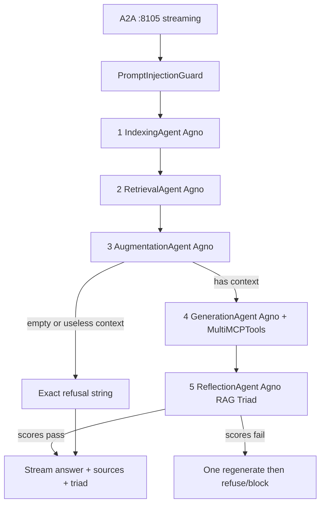

# Phase 10 — Agentic RAG (Clinical Q&A)

Authority: [`Documentation/REQUIREMENTS_REFERENCE.md`](Documentation/REQUIREMENTS_REFERENCE.md) **§5.6**, **§2 row 6**, **§3.4**, **§4**, **§8**, **§10.1–10.2**, **§18**. Style: [`Documentation/coding_style/rag.txt`](Documentation/coding_style/rag.txt) + Agno/`MultiMCPTools` patterns in [`Documentation/coding_style/MCP_A2A.txt`](Documentation/coding_style/MCP_A2A.txt). A2A shell mirrors [`agents/summary/a2a.py`](agents/summary/a2a.py).

## Hard constraints (MUST / MUST NOT)

| Rule | Source |
|------|--------|
| Entire RAG subsystem = **Agno only** (no LangGraph / ADK inside `rag/`) | §5.6, §2 |
| Exactly **five distinct** Agno agents (not one script with five roles) | §5.6 Table |
| Live under top-level [`rag/`](rag/) — never under `agents/` | §2 |
| A2A **`:8105`**, **`streaming=True`**, AgentCard + `X-Agent-Auth-Token` | §2, §4 |
| Refusal text **exact**: `I don't know — this information is not available in the patient records.` | §5.6, §18 |
| Generation prompt via MCP `get_prompt("rag-answer-prompt", context_length=…)` — never hardcoded | §3.4, §5.6 |
| `agno.Agent` + `MultiMCPTools`, `SqliteDb`, **`num_history_runs=3`**, **`await agent.arun(...)`** | §5.6 |
| Embeddings: **`sentence-transformers/all-MiniLM-L6-v2`** only | §10, `model_config.yaml` |
| Vector store: **FAISS** → `data/vector_db/` | §5.6, architecture |
| Out-of-context → exact refusal; never invent answers | §5.6, §15 |

**Conflict §16 row 5:** FA5 HallucinationChecker uses faithfulness `< 0.7`; `rules.yaml` has `rag_groundedness_min: 0.75`. **Resolve: enforce 0.75** (stricter floor from rules) for Triad groundedness gate; document in code comment citing §16.5.

## One-path beginner architecture



Index corpus: **`data/input/{doctor_reports,lab_reports,bills}/`** filtered by `patient_id` in filenames/metadata (same intake Monitor uses). FAISS metadata includes `patient_id`, `doc_type`, `source_path`. Retrieval always filters by patient.

**top-k = 4** (from `rag.txt` style; FA5 names top-k but gives no number).

## Dependencies (SSoT §10.1)

Via `uv add`:
- `agno==2.1.4`
- `faiss-cpu` (FA5 FAISS)
- `sentence-transformers` (FA5 embeddings)
- `numpy==2.3.3` (company pin)

Reuse existing LiteLLM/Bedrock for Generation + Reflection LLM calls (same stack as Extractor/Summary). No second embedding path (no Bedrock embeddings).

## Files to implement (fill existing stubs)

### Helpers (plain functions — not agents)

| File | Job |
|------|-----|
| [`rag/embeddings.py`](rag/embeddings.py) | Load MiniLM once; `embed_texts` / `embed_query` |
| [`rag/vectorstore.py`](rag/vectorstore.py) | FAISS load/save under `data/vector_db/`; add docs; search with `patient_id` filter + `k=4` |

### Five Agno agents (one file each — real `agno.Agent` instances)

| File | Responsibility |
|------|----------------|
| [`rag/indexing_agent.py`](rag/indexing_agent.py) | Load patient intake files → split (`RecursiveCharacterTextSplitter`) → embed → upsert FAISS. Agno Agent + tool wrapping `index_patient`. |
| [`rag/retrieval_agent.py`](rag/retrieval_agent.py) | Embed question → FAISS top-k for that `patient_id`. |
| [`rag/augmentation_agent.py`](rag/augmentation_agent.py) | Re-rank chunks by simple keyword overlap with the question (beginner-readable score). |
| [`rag/generation_agent.py`](rag/generation_agent.py) | **`MultiMCPTools`** to Primary (+ Secondary URLs from config) → fetch `rag-answer-prompt` → grounded answer with `SqliteDb` at `data/rag_sessions/`, `num_history_runs=3`, `await arun()`. Refusal string from `agent_config.yaml` `services.rag.refusal_text`. |
| [`rag/reflection_agent.py`](rag/reflection_agent.py) | LLM-as-judge returns `{faithfulness, answer_relevance, context_relevance}` in 0–1. Gate: faithfulness ≥ `rag_groundedness_min` (0.75), relevance ≥ `rag_relevance_min` (0.70). |

### Guardrails (minimal, RAG-required)

| File | Job |
|------|-----|
| [`shared/guardrails/prompt_injection_guard.py`](shared/guardrails/prompt_injection_guard.py) | Small pattern list; reject/sanitize query before retrieval |
| [`shared/guardrails/hallucination_checker.py`](shared/guardrails/hallucination_checker.py) | Block when faithfulness &lt; gate (use 0.75); one regenerate attempt |

### A2A + entry

| File | Job |
|------|-----|
| [`rag/pipeline.py`](rag/pipeline.py) **(new)** | Thin `async def ask(patient_id, question, session_id)` that calls the five agents in order — one clear path, readable for beginners |
| [`rag/a2a.py`](rag/a2a.py) | Copy Summary pattern: `streaming=True`, auth middleware, `TaskUpdater.start_work` → stream answer in small text chunks (token-like progressive output) + optional sources/triad artifacts → `complete`. Parse `patient_id` + question from message / embedded JSON. |
| [`rag/app.py`](rag/app.py) + [`rag/__main__.py`](rag/__main__.py) | `uv run python -m rag` → uvicorn `:8105` |

Generation Agent is the one that **must** wire `MultiMCPTools` + `SqliteDb` per §5.6. Other four agents are still real `agno.Agent` objects with tools (so we do not collapse into a non-agent script).

## Generation Agent MCP wiring (style-faithful)

```python
# Concept only — from MCP_A2A.txt Agno pattern
multi_mcp = MultiMCPTools(
    urls=[primary_url, secondary_url],
    urls_transports=["streamable-http", "streamable-http"],
)
await multi_mcp.connect()
agent = Agent(
    name="generation_agent",
    model=AwsBedrock(...),  # or project LiteLLM wrapper if Agno model adapter fits
    tools=[multi_mcp],
    db=SqliteDb(db_file="data/rag_sessions/rag.db", session_table="agent_sessions"),
    add_history_to_context=True,
    num_history_runs=3,
)
response = await agent.arun(user_message, session_id=session_id)
```

Prompt text must come from MCP (`rag-answer-prompt` with `context_length=len(context)`), injected into the agent instructions for that turn — never a hardcoded template string in agent code.

## Out-of-context / unsafe behavior

1. After Augmentation, if no chunks or keyword score is empty → stream **exact** refusal (no LLM invent).
2. If Generation returns the refusal (or empty) → stream it as-is.
3. If Reflection / HallucinationChecker fails → **one** regenerate via Generation; if still fail → refuse or emit `rag_unsafe_response` finding path (block answer; do not invent).

## Smoke tests (done when)

1. Index P1019 intake → FAISS files under `data/vector_db/`.
2. In-context ask (e.g. meds / diagnosis for P1019) → grounded answer + sources + Triad scores ≥ thresholds; streams on `:8105`.
3. Out-of-context ask (e.g. “Who won the World Cup?”) → **exact** refusal string, character-for-character.
4. AgentCard: `capabilities.streaming == true`, port 8105.
5. Confirm Generation used MCP prompt (log `get_prompt` / no hardcoded template).

## Docs after implementation

- Update [`README.md`](README.md) Phase 10 status + quick-start `uv run python -m rag`.
- Mark Phase 10 complete in [`.cursor/plans/phased_implementation_roadmap_816e3afe.plan.md`](.cursor/plans/phased_implementation_roadmap_816e3afe.plan.md).

## Explicitly out of Phase 10

- Streamlit HITL Page 4 UI (Phase 11)
- Host Gradio wiring (Phase 12)
- Qdrant/Weaviate, Bedrock embeddings, or any second RAG path
- Nesting RAG under `agents/`
