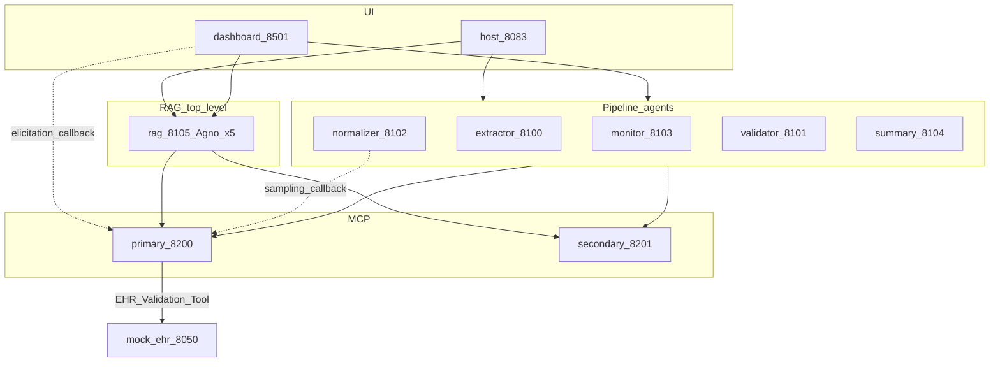

# Folder Structure Locked to REQUIREMENTS_REFERENCE.md (audited)

**Authority:** [`Documentation/REQUIREMENTS_REFERENCE.md`](Documentation/REQUIREMENTS_REFERENCE.md).  
**Rule:** If folder/file naming and the SSoT disagree, rename the code — never reinterpret the SSoT.

---

## 0. In-depth audit results (pre-scaffold)

### Correct (keep)

| Item | Verdict |
| --- | --- |
| All 11 SSoT services present with exact ports/frameworks | Pass |
| RAG top-level `rag/` (5 Agno agents + A2A :8105) | Pass |
| `sampling_callback` only under `agents/normalizer/` | Pass |
| Extractor = Tools + Resources + Prompts only (no Sampling) | Pass |
| Watcher on Primary MCP, not under Monitor agent | Pass |
| HITL 5 pages matching Table 13 | Pass |
| Mock EHR 5 JSON domains (no billing.json) | Pass |
| MCP paths `/clinicaltools`, `/analyticstools` | Pass |
| Guardrail class set includes ToxicityFilter | Pass |
| Runtime Root = `data/input/{doctor_reports,lab_reports,bills}/` | Pass |

### Issues found and fixed in this revision

| # | Issue | Fix |
| --- | --- | --- |
| 1 | Diagram showed `Validator → Mock EHR` directly | EHR access only via **Primary MCP EHR Validation Tool** → FastAPI :8050 |
| 2 | `elicitation_callback` required on Streamlit (§3.7) but no file | Add `dashboard/elicitation_callback.py` |
| 3 | Company multi-server MCP client config missing | Add `configs/mcp_servers.json` (urls + transports) |
| 4 | Agno `SqliteDb` / last-3-turns storage path missing | Add `data/rag_sessions/` for Agno session DB |
| 5 | Secondary MCP tools flat vs Primary `tools/` | Use `mcp_servers/secondary/tools/` for consistency |
| 6 | No thin shared LiteLLM helper for Sampling callback | Add `shared/llm.py` (LiteLLM only — used by Normalizer callback) |
| 7 | Dual `rules.yaml` (Documentation vs configs) drift risk | **Canonical runtime = `configs/rules.yaml`**; Documentation copy is seed only |
| 8 | `data/logs/` overlaps `data/reports/pipeline.log` | Drop `data/logs/`; use `data/reports/pipeline.log` per §6.5 |
| 9 | Mermaid agent order confusing (Validate before Normalize) | Reorder to Monitor → Extract → Normalize → Validate → Summary |
| 10 | Push Notifications underspecified (§4) | Capability flag in AgentCards / `agent_config.yaml` — no extra package |
| 11 | `GUIDELINES` in `data.py` not one of 5 EHR files (§16.7) | Keep in seed script / optional import only — **not** a sixth JSON domain |

### Explicitly not a problem

- `configs/model_config.yaml` — allowed helper for LiteLLM IDs; not a FA5 port source.
- `data/processed/` — implementation aid; not forbidden.
- `templates/discharge_summary.html` — backs `resource://report-template/html`.

---

## 1. SSoT component → folder map (locked)

| SSoT §2 Component | Framework | Port | Transport | Folder |
| --- | --- | --- | --- | --- |
| Discharge Monitor Agent | Google ADK | 8103 | A2A non-streaming | `agents/monitor/` |
| Clinical Extractor Agent | LangGraph | 8100 | A2A non-streaming | `agents/extractor/` |
| Clinical Normalizer Agent | LangGraph | 8102 | A2A non-streaming | `agents/normalizer/` |
| Clinical Validation Agent | LangGraph | 8101 | A2A non-streaming | `agents/validator/` |
| Discharge Summary Generator | Google ADK | 8104 | A2A **streaming** | `agents/summary/` |
| Clinical RAG Q&A (5 Agno agents) | Agno | 8105 | A2A **streaming** | `rag/` |
| Host Orchestrator | Google ADK | 8083 | Gradio + A2A client | `host/` |
| Streamlit HITL Dashboard | Streamlit | 8501 | HTTP (5 pages) | `dashboard/` |
| Primary MCP Clinical Tools | FastMCP | 8200 | `/clinicaltools` | `mcp_servers/primary/` |
| Secondary MCP Analytics | FastMCP | 8201 | `/analyticstools` | `mcp_servers/secondary/` |
| Mock EHR System | FastAPI | 8050 | HTTP/REST | `mock_ehr/` |

**MCP primitive ownership (must not relocate):**

| Primitive | Owner folder |
| --- | --- |
| Tools / Resources / Prompts | `mcp_servers/primary/` |
| Sampling (server side) | `mcp_servers/primary/tools/medical_lang_bridge.py` |
| Sampling (client callback) | `agents/normalizer/sampling_callback.py` |
| Elicitation (server `ctx.elicit`) | `mcp_servers/primary/tools/clinical_rules_engine.py` |
| Elicitation (UI callback) | `dashboard/elicitation_callback.py` |
| Roots | Monitor registers Root; Watcher uses `list_roots` in primary tools |



---

## 2. Canonical tree (post-audit)

```text
<repo-root>/
│
├── README.md
├── pyproject.toml
├── .env.example
├── .gitignore
├── run.py
│
├── Documentation/                          # SSoT + seeds + coding_style (read-only reference)
│   ├── REQUIREMENTS_REFERENCE.md
│   ├── FA5_...docx
│   ├── coding_style/
│   ├── configs/rules.yaml                  # SEED ONLY — copy into configs/ once
│   ├── mock_ehr/data.py                    # SEED for mock_ehr/data/*.json (+ GUIDELINES in code)
│   └── Data/incoming/                      # SEED corpus → sync to data/input/
│
├── configs/                                # RUNTIME canonical configs
│   ├── rules.yaml                          # MUST — SHA-256 = rules_version
│   ├── prompts.yaml                        # MUST — bodies for MCP §3.4 names
│   ├── agent_config.yaml                   # MUST — ports, Root URI, A2A auth key name, push flag
│   ├── model_config.yaml                   # LiteLLM model IDs / embeddings only
│   └── mcp_servers.json                    # multi-server client: primary+secondary URLs/transports
│
├── shared/
│   ├── settings.py
│   ├── logger.py                           # → data/reports/pipeline.log
│   ├── llm.py                              # LiteLLM wrapper (Normalizer sampling_callback)
│   ├── models/
│   │   ├── patient.py
│   │   ├── extraction.py
│   │   ├── validation.py
│   │   └── summary.py
│   ├── guardrails/
│   │   ├── pii_redactor.py                 # PIIRedactor
│   │   ├── hallucination_checker.py        # HallucinationChecker
│   │   ├── prompt_injection_guard.py       # PromptInjectionGuard
│   │   ├── toxicity_filter.py              # ToxicityFilter
│   │   └── guardrail_manager.py            # GuardrailManager
│   └── tracing/
│       └── langfuse.py
│
├── host/                                   # :8083 Gradio + ADK + A2A client
│   ├── app.py
│   ├── orchestrator.py
│   └── a2a_client.py
│
├── agents/
│   ├── monitor/                            # :8103 ADK — Roots register + call Watcher tool
│   │   ├── app.py
│   │   ├── agent.py
│   │   └── a2a.py
│   ├── extractor/                          # :8100 LangGraph — NO sampling_callback
│   │   ├── app.py
│   │   ├── graph.py
│   │   ├── state.py
│   │   ├── nodes.py                        # Harvester + Resources + discharge-extraction-prompt
│   │   └── a2a.py
│   ├── normalizer/                         # :8102 LangGraph — OWNS sampling_callback
│   │   ├── app.py
│   │   ├── graph.py
│   │   ├── state.py
│   │   ├── nodes.py                        # Medical Lang Bridge
│   │   ├── sampling_callback.py            # §3.6 ONLY HERE
│   │   └── a2a.py
│   ├── validator/                          # :8101 LangGraph — calls MCP tools (not EHR HTTP directly)
│   │   ├── app.py
│   │   ├── graph.py
│   │   ├── state.py
│   │   ├── nodes.py                        # Rules Engine, EHR Validation, Reporter, Secondary risk tools
│   │   └── a2a.py
│   └── summary/                            # :8104 ADK STREAMING
│       ├── app.py
│       ├── agent.py
│       └── a2a.py
│
├── rag/                                    # :8105 Agno STREAMING — top-level subsystem
│   ├── app.py
│   ├── a2a.py
│   ├── indexing_agent.py
│   ├── retrieval_agent.py
│   ├── augmentation_agent.py
│   ├── generation_agent.py                 # get_prompt("rag-answer-prompt")
│   ├── reflection_agent.py
│   ├── embeddings.py                       # all-MiniLM-L6-v2
│   └── vectorstore.py                      # → data/vector_db/
│
├── mcp_servers/
│   ├── primary/                            # :8200 /clinicaltools — all 6 primitives
│   │   ├── server.py
│   │   ├── tools/
│   │   │   ├── clinical_watcher.py
│   │   │   ├── clinical_data_harvester.py
│   │   │   ├── medical_lang_bridge.py      # ctx.session.create_message + ModelPreferences
│   │   │   ├── clinical_rules_engine.py    # ctx.elicit
│   │   │   ├── ehr_validation.py           # HTTP client → mock_ehr :8050
│   │   │   └── clinical_insight_reporter.py
│   │   ├── resources.py                    # §3.3 exact URIs
│   │   ├── prompts.py                      # §3.4 exact names
│   │   ├── sampling.py                     # shared helpers for Lang Bridge
│   │   ├── elicitation.py                  # schema helpers for Rules Engine
│   │   └── roots.py                        # Path.relative_to guards
│   └── secondary/                          # :8201 /analyticstools
│       ├── server.py
│       └── tools/
│           ├── calculate_risk_score.py
│           ├── get_population_benchmarks.py
│           └── generate_risk_heatmap.py
│
├── mock_ehr/                               # :8050 FastAPI ONLY
│   ├── app.py
│   ├── routes.py
│   └── data/
│       ├── patients.json
│       ├── medications.json
│       ├── allergies.json
│       ├── labs.json
│       └── care_plans.json
│
├── dashboard/                              # :8501 Streamlit — 5 FA5 pages
│   ├── app.py
│   ├── elicitation_callback.py             # §3.7 accept/decline/cancel → ElicitResult
│   ├── pages/
│   │   ├── 1_Document_Viewer.py
│   │   ├── 2_Validation_Report.py
│   │   ├── 3_HITL_Corrections.py            # st.data_editor + uses elicitation_callback
│   │   ├── 4_RAG_QA.py
│   │   └── 5_Discharge_Summary.py
│   └── components/
│
├── templates/
│   └── discharge_summary.html              # resource://report-template/html
│
├── data/
│   ├── input/
│   │   ├── doctor_reports/
│   │   ├── lab_reports/
│   │   └── bills/
│   ├── processed/
│   ├── reports/                            # audit JSON/HTML/PDF + pipeline.log
│   ├── vector_db/                          # FAISS
│   └── rag_sessions/                       # Agno SqliteDb (num_history_runs=3)
│
└── tests/
    ├── unit/
    └── integration/
```

---

## 3. Locked naming contracts

### MCP Resources (§3.3) → `mcp_servers/primary/resources.py`

- `resource://clinical-rules/completeness` ← `configs/rules.yaml`
- `resource://clinical-rules/cross-validation` ← `configs/rules.yaml`
- `resource://discharge-report/{patient_id}` ← `data/input/doctor_reports/`
- `resource://lab-report/{patient_id}` ← `data/input/lab_reports/`
- `resource://report-template/html` ← `templates/discharge_summary.html`
- `resource://medical-abbreviations` ← abbreviation map in `configs/rules.yaml` (§6.2)

### MCP Prompts (§3.4) → `mcp_servers/primary/prompts.py` (bodies from `configs/prompts.yaml`)

| Prompt | Params | Consumer |
| --- | --- | --- |
| `discharge-extraction-prompt` | language, doc_types | `agents/extractor/` |
| `ehr-cross-validation-prompt` | patient_id | `agents/validator/` |
| `abbreviation-normalization-prompt` | source_language | `agents/normalizer/` |
| `summary-generation-prompt` | risk_level, audience | `agents/summary/` |
| `rag-answer-prompt` | context_length | `rag/generation_agent.py` |

### Primary tools (§3.5) → `mcp_servers/primary/tools/`

Clinical Watcher · Clinical Data Harvester · Medical Lang Bridge · Clinical Rules Engine · EHR Validation · Clinical Insight Reporter

### Secondary tools (§3.5) → `mcp_servers/secondary/tools/`

`calculate_risk_score` · `get_population_benchmarks` · `generate_risk_heatmap`

### A2A (§4)

- SDK: `a2a-sdk` in every `a2a.py` + `host/a2a_client.py` + `rag/a2a.py`
- AgentCard: `/.well-known/agent.json`
- Auth: `X-Agent-Auth-Token`
- Streaming: `agents/summary/`, `rag/` only
- Push Notifications: capability present in cards/config (behavior NOT SPECIFIED)

### Guardrails (§8)

`PIIRedactor` · `HallucinationChecker` · `PromptInjectionGuard` · `ToxicityFilter` · `GuardrailManager`

---

## 4. Paths (conflict §16.4 locked)

| Role | Path |
| --- | --- |
| MCP Root workspace | `data/input/` |
| Seed corpus | `Documentation/Data/incoming/` → sync into `data/input/` |
| FAISS | `data/vector_db/` |
| Audit reports + `pipeline.log` | `data/reports/` |
| Agno sessions | `data/rag_sessions/` |
| Root URI example shape | `file:///…/data/input` |

---

## 5. Forbidden (will conflict with SSoT later)

- `sampling_callback` under extractor (or any non-normalizer agent)
- Watcher filesystem logic inside `agents/monitor/` (MCP tool only)
- RAG under `agents/` or as non-Agno scripts
- Validator/Host calling Mock EHR REST directly (must use EHR Validation MCP tool)
- Prompt hardcoding in agents (must `get_prompt`)
- Streamlit ≠ 5 FA5 pages; Gradio used for HITL; FastAPI used for A2A agents
- Sixth Mock EHR JSON (`billing.json`) or treating GUIDELINES as required EHR domain file
- Editing `Documentation/configs/rules.yaml` as runtime source of truth (use `configs/rules.yaml`)

---

## 6. Sync with SSoT on scaffold

1. Add **Project Layout** to `REQUIREMENTS_REFERENCE.md` = this tree + component map.  
2. Any package rename updates that section in the same PR/commit.

---

## 7. Implementation order (after confirm)

1. SSoT Project Layout section + empty tree  
2. `configs/agent_config.yaml` + `mcp_servers.json`  
3. `mock_ehr`  
4. `mcp_servers/primary` then `secondary`  
5. extractor → normalizer (+ sampling_callback) → validator  
6. monitor → summary → host  
7. `rag/` five Agno agents + A2A  
8. dashboard 5 pages + `elicitation_callback.py`  
9. guardrails + LangFuse  
10. `run.py`  

No application logic until you confirm this audited structure.
