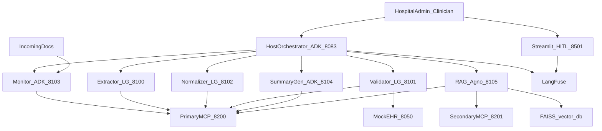

# Project Understanding Report

**Project:** Agentic AI System for Automated Discharge Summaries for Hospitals  
**Capstone code:** FA5_SP_Interns_Capstone_AI_Discharge_Summaries  
**Scope of sources:** Everything under `cap_proj/documentation/`  
**Audience:** New developer joining with no prior project context  
**Nature:** Understanding only — no implementation guidance beyond what the docs require

---

# 1. Executive Summary

## What is the project?

An **end-to-end Agentic AI system** that automates hospital discharge management. It ingests multi-format, multi-language clinical documents (discharge reports, lab reports, hospital bills), extracts and normalizes clinical data, validates completeness and consistency against a Mock EHR and configurable rules, supports human-in-the-loop (HITL) review, answers clinical questions via Agentic RAG, and generates patient-friendly discharge summaries with full audit trails.

Source: primary FA5 docx (Project Overview, Objectives).

## Why is it being built?

A global multi-specialty hospital network handles high discharge volume across regions. Documents arrive in mixed formats (PDF, DOCX, scanned/handwritten, structured exports) and languages (English, Hindi, Spanish, German — samples also include Dutch). Manual review is slow, error-prone, and dependent on senior clinical staff.

Source: FA5 §1.2 Business Context.

## What business problem does it solve?

Failures in discharge documentation cause:

- Re-admissions  
- Medication errors  
- Missed follow-ups  
- Regulatory non-compliance

The system reduces those risks by validating documents, flagging care gaps, blocking unsafe auto-release, and producing standardized summaries for care continuity.

## Who are the end users?

- **Hospital Admin / Clinician** — primary users of the Streamlit HITL Dashboard (`:8501`)  
- **Human reviewers** — respond to MCP Elicitation forms and approve/edit/reject discharges  
- **Hospital administrators** — use the Agentic RAG Q&A assistant for context-aware questions

Source: FA5 architecture (USER LAYER), §2.6, §8 HITL Dashboard.

## What value does it provide?

- Faster, more consistent discharge review  
- Automated completeness and EHR cross-checks  
- Interactive collection of missing fields  
- Risk scoring and clear Approve / Edit / Reject recommendations  
- Patient-friendly streaming summaries  
- Traceable observability (LangFuse) and Responsible AI guardrails  
- Demonstration of multi-framework agents (LangGraph, Google ADK, Agno), dual MCP servers (all 6 primitives), and A2A protocol

## What is the expected outcome?

A working NuvePro Lab deployment that:

1. Watches an input folder for new patient packets
2. Extracts, translates, and normalizes clinical content
3. Validates against `rules.yaml` + Mock EHR
4. Produces JSON + HTML/PDF audit/risk reports
5. Streams discharge summaries (when allowed)
6. Supports HITL corrections and re-runs
7. Exposes RAG Q&A with grounded answers
8. Traces every agent/tool/LLM/guardrail event in LangFuse

---

# 2. Documentation Overview

## How documentation is organized

```
documentation/
├── FA5_SP_Interns_Capstone_AI_Discharge_Summaries.docx   # Primary requirements / architecture
├── configs/
│   └── rules.yaml                                       # Validation & risk rules (given)
├── mock_ehr/
│   └── data.py                                          # EHR seed data (given; not a running API)
├── Data/
│   └── incoming/                                        # Sample clinical packets (given)
│       ├── doctor_reports/
│       ├── lab_reports/
│       └── bills/
└── test/                                                # Empty placeholder
```

The FA5 doc is the **contract**. `rules.yaml` and `data.py` are **behavioral seeds**. `Data/incoming` is the **test corpus**. Configs named in FA5 but absent (`prompts.yaml`, `agent_config.yaml`) and the Mock EHR FastAPI service are **implementer responsibilities**.

## Documents reviewed

### 2.1 FA5_SP_Interns_Capstone_AI_Discharge_Summaries.docx


| Attribute      | Detail                                                                                                                                  |
| -------------- | --------------------------------------------------------------------------------------------------------------------------------------- |
| **Purpose**    | Primary project specification                                                                                                           |
| **Topics**     | Overview, requirements, agents, MCP dual servers, A2A, architecture, RAI, LangFuse, HITL pages, tech stack, port map                    |
| **Importance** | Highest — defines what must be built                                                                                                    |
| **Relations**  | References `configs/rules.yaml`, Mock EHR `:8050`, input paths, FAISS, LangFuse; sample data and `data.py` operationalize its scenarios |


### 2.2 configs/rules.yaml


| Attribute      | Detail                                                                                                                                                                                                 |
| -------------- | ------------------------------------------------------------------------------------------------------------------------------------------------------------------------------------------------------ |
| **Purpose**    | Single source of truth for clinical validation and risk scoring                                                                                                                                        |
| **Topics**     | Mandatory fields, Rx fields, abbreviations, ICD-10 map, languages, clinical policies, risk weights/thresholds, HITL hard guardrails, RAG/translation quality, reporting, logging, business rules, SLAs |
| **Importance** | Runtime behavior of Completeness / EHR Validation / Reporting agents; audit stamps SHA-256 as `rules_version`                                                                                          |
| **Relations**  | Implements FA5 completeness/cross-validation intent (with naming drift); drives expected outcomes for sample patients                                                                                  |


### 2.3 mock_ehr/data.py


| Attribute      | Detail                                                                                                        |
| -------------- | ------------------------------------------------------------------------------------------------------------- |
| **Purpose**    | Hard-coded EHR truth for cross-validation test design                                                         |
| **Topics**     | PATIENTS, ALLERGIES, MED_ORDERS, LABS, CARE_PLANS, GUIDELINES; intentional mismatches per patient in comments |
| **Importance** | Defines what “correct EHR” looks like for P1001–P1024                                                         |
| **Relations**  | Must back Mock EHR API required by FA5; aligns with incoming files for P1019–P1024                            |


### 2.4 Data/incoming/* (28 content files)


| Attribute      | Detail                                                                                |
| -------------- | ------------------------------------------------------------------------------------- |
| **Purpose**    | Multimodal sample discharge packets                                                   |
| **Topics**     | Doctor reports, labs, bills in txt/json/pdf/png; OCR sidecars; languages en/es/hi/nl  |
| **Importance** | Concrete inputs the Monitor → Extractor → Normalizer → Validator pipeline must handle |
| **Relations**  | Patient IDs map to `data.py`; defects match `rules.yaml` risk drivers                 |


### 2.5 documentation/test/

Empty. No test specs. Importance: placeholder only.

### 2.6 Missing artifacts named in FA5 but not present

- `configs/prompts.yaml`  
- `configs/agent_config.yaml`  
- FastAPI Mock EHR app + five JSON files (`patients`, `medications`, `allergies`, `labs`, `care_plans`)

---

# 3. Folder Structure Understanding

## Structure and intent


| Path                                                | Why it exists                               | How it connects                                        |
| --------------------------------------------------- | ------------------------------------------- | ------------------------------------------------------ |
| Root docx                                           | Spec / architecture / ports / stack         | Points at configs, data paths, Mock EHR                |
| `configs/`                                          | Separates tunable clinical policy from code | Loaded as MCP Resources at runtime (FA5)               |
| `mock_ehr/`                                         | Separates EHR seed from agent code          | Consumed by EHR Validation Tool via REST (to be built) |
| `Data/incoming/{doctor_reports,lab_reports,bills}/` | Simulates hospital inbox by document type   | Scanned via MCP Roots by Discharge Monitor             |
| `test/`                                             | Reserved for tests                          | Empty today                                            |


## Sample naming conventions (from Data)

- Doctor: `P{id}_{firstname}_{lastname}.{ext}`  
- Labs: `P{id}_labs.{ext}`  
- Bills: `P{id}_bill.{ext}`  
- OCR sidecar: `{binary}.{ext}.ocr.txt` (doctor/lab binaries; bill binaries often lack OCR and use JSON companions)

## Path naming inconsistency

- FA5 diagram: `data/input/P001/` and Root example `file:///data/input`  
- Actual samples: `documentation/Data/incoming/` with IDs **P1019–P1024**

Implementers must reconcile these paths; the documentation does not specify the final runtime path mapping.

---

# 4. Project Requirements

## Functional Requirements

Each item is a distinct requirement from the documentation.

### FR-01 Document monitoring (Google ADK)

Discharge Monitor Agent scans the incoming folder for new discharge reports, lab reports, and bills. File-system simulation is sufficient (no live EHR feed).  
**MCP Roots (mandatory):** register input folder as Root URI; Clinical Watcher uses `ctx.list_roots()`; path-traversal prevention via `Path.relative_to()`.  
Source: FA5 §2.1.

### FR-02 Clinical data extraction (LangGraph)

Clinical Extractor Agent (StateGraph + MemorySaver) extracts structured/unstructured data from discharge reports, labs, medication lists, clinical notes, and bills. Multi-language and multi-modal.  
Uses MCP Resources and Prompts (`discharge-extraction-prompt`).  
Source: FA5 §2.2, Tables 1–2.

### FR-03 Language normalization & translation (LangGraph + MCP Sampling)

Clinical Normalizer focuses on **primary languages** from seed + `rules.yaml`: en/es/hi/de/fr/nl → English. Unexpected languages use a **fallback** multilingual Sampling path (still translate; never reject). Normalizes abbreviations (e.g., BID, PO). Must include **translation confidence score**.  
**MCP Sampling (mandatory):** Medical Lang Bridge issues `ctx.session.create_message()` with ModelPreferences (`nova-lite` multilingual / fallback, `command-r-plus` English); LangGraph `sampling_callback` routes via LiteLLM.  
Source: FA5 §2.3; helpers in `shared/language.py`.

### FR-04 Completeness validation

Validate discharge, lab, bill (and per-med prescription rows) against rules. Blocking missing fields block auto-summary generation; HITL required.  
FA5 Table 3 lists fields/blocking sets; `rules.yaml` lists mandatory clinical + Rx fields and soft weights for address/gender.  
Source: FA5 §2.4.1; `rules.yaml` §§1,4,8.

### FR-05 MCP Elicitation for missing fields

Non-blocking missing fields → `ctx.elicit()` with Pydantic schema. Outcomes: accept / decline / cancel. Streamlit implements `elicitation_callback`.  
Source: FA5 §2.4.1.

### FR-06 Cross-validation vs Mock EHR / care plan / labs

Rules (FA5 Table 4): med omission, allergy contradiction, diagnosis mismatch, follow-up missing, lab follow-up mismatch, discharge approval, bill settlement — Warning vs Critical; Flag vs Block.  
`rules.yaml` encodes related weights/policies (`allergy_must_not_match_prescription`, `abnormal_lab_requires_followup`, `bill_must_be_paid_before_release`, etc.).  
Source: FA5 §2.4.2; `rules.yaml`; exercised by `data.py` + samples.

### FR-07 Audit & risk report generation

Produce clinician/admin-friendly audit report: JSON (system) + HTML/PDF (human). Include missing fields, EHR discrepancies, med conflicts, translation confidence, risk Low/Medium/High, recommendation Approve/Edit/Reject, LangFuse trace IDs, bill amount/payment status.  
`rules.yaml` reporting: formats `[json, html]`, recommendation strings for low/medium/high, output `data/reports`.  
Source: FA5 §2.5; `rules.yaml` §6.

### FR-08 Agentic RAG Q&A (Agno)

Five Agno roles: Indexing, Retrieval, Augmentation (keyword re-rank), Generation (prompt via MCP `rag-answer-prompt`), Reflection (RAG Triad: Faithfulness / Answer Relevance / Context Relevance).  
Out-of-context answer must be: *"I don't know — this information is not available in the patient records."*  
`agno.Agent` + MultiMCPTools + SqliteDb (last 3 turns) + async `arun()`; A2A on port 8105 streaming.  
Source: FA5 §2.6.

### FR-09 Dual MCP servers

Agents connect to both servers:


| Server                 | Port | Path              | Primitives / tools                                                                       |
| ---------------------- | ---- | ----------------- | ---------------------------------------------------------------------------------------- |
| Primary Clinical Tools | 8200 | `/clinicaltools`  | All 6 primitives; Watcher, Harvester, Lang Bridge, Rules Engine, EHR Validator, Reporter |
| Secondary Analytics    | 8201 | `/analyticstools` | Tools: `calculate_risk_score`, `get_population_benchmarks`, `generate_risk_heatmap`      |


Source: FA5 §4, Tables 7–9.

### FR-10 A2A protocol for all agents

Each agent exposes AgentCard at `GET /.well-known/agent.json`. Auth via shared secret header `X-Agent-Auth-Token`. Streaming required for Summary Generator (8104) and RAG (8105); others non-streaming. Cover mentions Push Notifications; detailed push API Not specified beyond stack mention.  
Source: FA5 §5, Table 10, cover.

### FR-11 Host Orchestrator

Google ADK Host Orchestrator on Gradio `:8083`, A2A client streaming-capable, coordinates agents.  
Source: FA5 Table 6, architecture, port map.

### FR-12 HITL Streamlit dashboard (5 pages)

1. Document Viewer — patient selector, Discharge/Lab/Bill tabs, language badge, structured preview, process trigger
2. Validation Report — completeness score, cross-val issues, risk badge, recommendation, blocked indicator, LangFuse link
3. HITL Corrections — editable meds (`st.data_editor`), elicitation form, risk override, approval, save feedback, re-run validation streaming
4. RAG Q&A — patient filter, example queries, injection indicator, streaming answer, sources, RAG Triad metrics
5. Discharge Summary — patient-friendly summary, plain-English Rx table, colour-coded labs, export JSON/HTML/PDF, LangFuse link

Source: FA5 §8 Table 13.

### FR-13 Responsible AI guardrails


| Guardrail              | Trigger                         | Action                      |
| ---------------------- | ------------------------------- | --------------------------- |
| PII/PHI Redaction      | name, phone, Aadhaar, PAN       | Mask before logging/API     |
| Hallucination Check    | RAG faithfulness < 0.7          | Block; request regeneration |
| Prompt Injection Guard | injection patterns              | Sanitize/reject; alert      |
| Toxicity Filter        | clinical instruction LLM output | Filter before summary       |
| HITL Escalation        | High risk or discharge_blocked  | Mandatory human review      |


Source: FA5 §7.1. Note: `rules.yaml` uses `rag_groundedness_min: 0.75` (related but different threshold naming).

### FR-14 LangFuse observability

End-to-end trace ID per discharge case; per-agent spans; per-tool spans; LLM generation events; sampling events; elicitation events; guardrail spans; error spans.  
Source: FA5 §7.2.

### FR-15 Mock EHR system

FastAPI `:8050` exposing Patients, Meds, Allergies, Labs, Care Plans. FA5 says 5 JSON data files; provided seed is Python dicts in `data.py` (plus GUIDELINES).  
Source: FA5 Table 14 / port map; `mock_ehr/data.py`.

### FR-16 Risk scoring & business release rules

From `rules.yaml`: composite score from weighted findings; auto-approve max 2; standard HITL max 8; bill paid + discharge_ok required; SLAs (auto 60s / HITL 4h / urgent 30m). Secondary MCP Risk Score tool supports analytics.  
Source: `rules.yaml` §§4,8; FA5 Table 7–8.

---

## Non-Functional Requirements


| Area                | What documentation states                                                                 | Gap                                                               |
| ------------------- | ----------------------------------------------------------------------------------------- | ----------------------------------------------------------------- |
| **Security**        | A2A shared-secret `X-Agent-Auth-Token`; path-traversal prevention on Roots                | Broader auth model, encryption at rest/transit: **Not specified** |
| **Privacy**         | PII/PHI redaction (name, phone, Aadhaar, PAN) before logging/API                          | Full PHI inventory / retention: **Not specified**                 |
| **Performance**     | SLAs in `rules.yaml` (60s / 4h / 30m); streaming for progressive UI                       | Throughput, latency SLOs for LLM: **Not specified** beyond SLAs   |
| **Scalability**     | Multi-region business context; dual MCP; multi-agent                                      | Horizontal scale design: **Not specified**                        |
| **Reliability**     | Error spans with fallback action; decline/cancel elicitation paths                        | HA/failover: **Not specified**                                    |
| **Compliance**      | Audit trails, `rules_version` SHA-256, regulatory non-compliance as business driver       | Specific regulation (HIPAA etc.): **Not specified**               |
| **Maintainability** | YAML-driven rules; MCP Resources for rules/prompts; three frameworks by design            | —                                                                 |
| **Availability**    | **Not specified in the documentation**                                                    | —                                                                 |
| **Logging**         | `rules.yaml`: INFO, audit trail, tool calls, `data/reports/pipeline.log`; LangFuse traces | —                                                                 |
| **Monitoring**      | LangFuse real-time observability for agents, tools, LLM, guardrails                       | —                                                                 |


Deployment target: **NuvePro Lab** (FA5 Table 14).

---

# 5. Complete System Understanding

## Major modules and responsibilities




## End-to-end user / document / AI flow (conceptual)

1. **Ingest:** New files appear under incoming folders (doctor / lab / bill). Monitor discovers them via Roots-scoped Watcher.
2. **Harvest:** Harvester extracts text/tables/images (OCR optional / sidecars present in samples).
3. **Extract:** Extractor structures clinical fields using MCP prompts/resources.
4. **Normalize:** Normalizer translates to English + expands abbreviations via Sampling; emits confidence.
5. **Validate:** Rules Engine checks completeness (elicit if needed); EHR Validation Tool cross-checks Mock EHR; Secondary analytics may score risk.
6. **Report:** Insight Reporter emits JSON + HTML audit/risk report with recommendation.
7. **Gate:** If blocked / High risk → HITL mandatory; else Low may auto-approve per rules.
8. **Summary:** When allowed, Summary Generator streams patient-friendly sections (patient → meds → labs → bill → instructions).
9. **RAG:** Documents indexed to FAISS; admins ask questions; grounded answers or “I don’t know…”.
10. **Observe:** Every step traced in LangFuse; guardrails intervene as configured.

Backend flow is agent-orchestrated over **A2A**; tools live on **MCP**; EHR is **HTTP REST**; UI is **Streamlit + Gradio**.

---

# 6. AI Understanding

## Why AI is needed

Clinical documents are unstructured, multilingual, and multimodal. Rules alone cannot extract, translate, summarize, or answer free-form questions. LLMs provide extraction, translation, summarization, and grounded Q&A; agents coordinate tools and HITL.

## Where AI is used


| Use                                         | Agent / component                                         |
| ------------------------------------------- | --------------------------------------------------------- |
| Extraction                                  | Clinical Extractor + Harvester                            |
| Translation / abbreviation normalization    | Normalizer + Medical Lang Bridge (Sampling)               |
| Summary generation                          | Discharge Summary Generator (streaming)                   |
| RAG answer generation + reflection          | Agno 5-role pipeline                                      |
| Hallucination / toxicity / injection checks | RAI modules (LLM-as-judge for hallucination)              |
| Risk heatmap / analytics (tools)            | Secondary MCP (nature of LLM use **Not fully specified**) |


## Expected AI workflow

Monitor → Extract → Normalize (Sampling) → Validate (rules + EHR + optional elicit) → Report/Risk → (HITL if needed) → Stream Summary and/or RAG Index/QA.

## LLM usage

- Primary: **AWS Bedrock Nova Lite**  
- Fallback: **Cohere Command R+**  
- Gateway: **LiteLLM**  
- Sampling hints: `nova-lite` multilingual, `command-r-plus` English

Source: FA5 Table 14, §2.3.

## Prompting

MCP Prompts on Primary server (not hardcoded for RAG):

- `discharge-extraction-prompt` (language, doc_types)  
- `ehr-cross-validation-prompt` (patient_id)  
- `abbreviation-normalization-prompt` (source_language)  
- `summary-generation-prompt` (risk_level, audience)  
- `rag-answer-prompt` (context_length)

`configs/prompts.yaml` is listed in stack but **file not provided** — prompt bodies must be created by implementer unless embedded elsewhere (Not specified).

## RAG / Embeddings / Vector DB

- Index discharge documents into **FAISS** at `data/vector_db/`  
- Embeddings: `sentence-transformers/all-MiniLM-L6-v2`  
- Optional vector DBs: Qdrant / Weaviate  
- Retrieval top-k → keyword re-rank → generate → RAG Triad reflection  
- Faithfulness gate: FA5 guardrail blocks if faithfulness < 0.7; `rules.yaml` also sets groundedness 0.75 / relevance 0.70

## Confidence scoring

- Translation confidence required in Normalizer output; min 0.70 in `rules.yaml`; low confidence adds risk weight 3 and hard HITL guardrail

## Human review

HITL dashboard + elicitation + hard guardrails + High risk / discharge_blocked → no auto-approve.

## Medical safety

Allergy vs prescription checks; high-risk meds counseling list (Warfarin, Insulin, Methotrexate, Digoxin, Heparin); abnormal labs need follow-up; pediatric/obstetric/oncology always HITL; Critical FA5 rules block discharge (allergy, follow-up missing, approval, unpaid bill).

## Validation & error handling

Validation via Rules Engine + EHR tool + risk matrix. Elicitation decline marks unresolved; cancel aborts/escalates. LangFuse error spans record exception, stack, fallback. Detailed fallback algorithms beyond that: **Not specified**.

---

# 7. Data Flow

## Where data comes from

1. **Incoming files** — doctor_reports, lab_reports, bills (samples under `Data/incoming`)
2. **Mock EHR** — patients, allergies, med orders, labs, care plans (seed in `data.py`)
3. **rules.yaml** — completeness, policies, scores (also abbreviation/ICD maps)
4. **Human reviewer** — elicitation answers, corrections, approval decisions
5. **Admin questions** — RAG Q&A page

## How data moves

Files → Monitor (Roots) → Harvester text → Extractor structured JSON-like clinical objects → Normalizer English+confidence → Validator (rules resource + EHR API + elicit) → Reporter artifacts → optional Summary stream → FAISS index for RAG → answers/metrics to UI. Trace IDs flow in A2A message metadata.

## What is stored


| Store                   | Content                           |
| ----------------------- | --------------------------------- |
| FAISS `data/vector_db/` | Indexed discharge chunks          |
| `data/reports/`         | JSON/HTML reports, `pipeline.log` |
| SqliteDb (Agno)         | Last 3 RAG session turns          |
| LangFuse                | Traces/spans/LLM logs             |
| Mock EHR (runtime)      | Seeded patient records            |


Exact DB for HITL feedback persistence: **Not specified** beyond “Save feedback” UI feature.

## What is returned / final outputs

- Structured extracted clinical data  
- Validation / risk report (JSON + HTML; PDF mentioned in FA5)  
- Recommendation: Approve / Edit / Reject (FA5) or Approve Auto-release / Standard HITL / Block release (`rules.yaml` wording)  
- Streaming patient-friendly discharge summary  
- RAG answers with sources + Triad metrics  
- Exports: JSON / HTML / PDF from Summary page

---

# 8. Architecture Understanding

## Components and ports


| Service               | Port                   | Role                          |
| --------------------- | ---------------------- | ----------------------------- |
| Mock EHR (FastAPI)    | 8050                   | REST clinical truth           |
| Primary MCP           | 8200 `/clinicaltools`  | 6 primitives + clinical tools |
| Secondary MCP         | 8201 `/analyticstools` | Risk/benchmarks/heatmap       |
| Extractor A2A         | 8100                   | LangGraph non-streaming       |
| Validator A2A         | 8101                   | LangGraph non-streaming       |
| Normalizer A2A        | 8102                   | LangGraph non-streaming       |
| Monitor A2A           | 8103                   | ADK non-streaming             |
| Summary Generator A2A | 8104                   | ADK **streaming**             |
| RAG Q&A A2A           | 8105                   | Agno **streaming**            |
| Host Orchestrator     | 8083                   | ADK + Gradio + A2A client     |
| Streamlit HITL        | 8501                   | 5-page review UI              |


## Integration points

- **A2A** between Host/HITL and agents (discover via AgentCard; auth token)  
- **MCP** between agents and tool servers (`mcp-use` multi-server client)  
- **HTTP REST** agent ↔ Mock EHR  
- **Sampling / Elicitation callbacks** MCP server ↔ agent LLM client / Streamlit  
- **LangFuse** instrumentation across stack  
- **External LLMs** via LiteLLM → Bedrock / Cohere

## External systems

- AWS Bedrock, Cohere APIs  
- LangFuse  
- Optional Tesseract OCR  
- NuvePro Lab deployment environment

No live hospital EHR — Mock only (FA5 explicit).

---

# 9. Inputs and Outputs

## Inputs

- Discharge reports (txt/pdf/png/json; DOCX supported per FA5)  
- Lab reports (same modality mix)  
- Hospital bills (json/pdf/png/txt)  
- OCR sidecar text where provided  
- `rules.yaml` (and intended prompts/agent configs)  
- Mock EHR records  
- Reviewer form inputs / med table edits / approval  
- RAG natural-language questions

## Outputs / artifacts

- Structured extractions clinical data  
- Translation confidence scores  
- Completeness / cross-validation findings  
- Risk score + Low/Medium/High  
- Audit reports JSON + HTML (+ PDF per FA5)  
- `rules_version` hash on reports  
- Streaming summary sections  
- RAG answers, sources, Triad scores  
- LangFuse traces  
- `pipeline.log`  
- Dashboard exports JSON/HTML/PDF

## APIs

- A2A agent endpoints + `/.well-known/agent.json`  
- MCP streamable-HTTP on 8200/8201  
- Mock EHR REST on 8050  
- Streamlit HTTP 8501; Gradio 8083

Exact REST path schemas for EHR: **Not specified** (only resource domains).

---

# 10. Deliverables

The final project is expected to deliver a **working integrated system** demonstrating:

1. Three agent frameworks (LangGraph, Google ADK, Agno) coordinated by Host Orchestrator
2. Dual MCP servers with **all six MCP primitives** demonstrable
3. A2A streaming and non-streaming agents with auth
4. Full discharge pipeline: monitor → extract → normalize → validate → report → summary
5. HITL Streamlit (5 pages) with elicitation and re-run
6. Agentic RAG Q&A with FAISS + Triad reflection
7. RAI guardrails + LangFuse observability
8. Mock EHR FastAPI backed by provided seed data
9. Config-driven validation via `rules.yaml`
10. Deployment on **NuvePro Lab**

Formal grading rubric: **Not specified in the documentation.**

---

# 11. Assumptions, Constraints & Dependencies

## Stated assumptions / constraints

- File-system simulation sufficient for document intake (no live EHR integration)  
- Shared-secret A2A auth  
- Python 3.11+  
- Primary LLM Bedrock Nova Lite; Cohere Command R+ fallback  
- FAISS primary vector store  
- Hospital policy: bill must be paid; discharge_ok required (`rules.yaml`)  
- Deployment: NuvePro Lab

## Dependencies

- LangGraph, Google ADK, Agno  
- FastMCP / MCP stack, `mcp-use`, `a2a-sdk`  
- LiteLLM, sentence-transformers, FAISS  
- Streamlit, Gradio, FastAPI  
- LangFuse  
- Optional Tesseract

## Limitations / risks (from docs + corpus)

- Only 6 patients have incoming files; 18 EHR patients lack sample docs  
- OCR quality depends on sidecars / optional Tesseract  
- Multilingual including Dutch/French beyond FA5 language list  
- Allergy detection must handle spelling variants (Amoxicillin / Amoxicilline)  
- Push Notifications mentioned but underspecified

## Prerequisites

Understanding of MCP primitives, A2A, agent frameworks, clinical discharge domain concepts.

---

# 12. Important Details (easy to overlook)

1. **All 6 MCP primitives are mandatory** and mapped to specific tools/agents.
2. **Sampling separates LLM resource management (client) from tool logic (server).**
3. **Elicitation is only for non-blocking gaps**; blocking fields stop auto-summary.
4. **RAG must refuse** with the exact “I don’t know…” sentence when out of context.
5. **RAG prompt must be fetched via MCP** — no hardcoded generation prompt.
6. **Agno session memory = last 3 turns** in SqliteDb.
7. **Summary streaming order:** patient → meds → labs → bill → instructions.
8. **Trace ID must propagate** through all agents via message metadata.
9. `**rules_version` = SHA-256 of rules.yaml** on every audit report.
10. **P1022/P1024** are deliberate HARD HITL allergy cases (Penicillin + Amoxicilline).
11. **P1020** missing address is intentionally soft (weight 1) → still auto-approve.
12. **P1021** combines UNPAID + null address/follow-up + Hindi.
13. **P1024 labs** flag CRP 38 as NORMAAL despite ref <5 — data quality trap.
14. **Bill binaries often lack `.ocr.txt`**; JSON companions carry structure.
15. `**GUIDELINES**` exist in `data.py` but are not one of FA5’s five JSON file names.
16. **High-risk meds list** and service-line always-HITL are only in `rules.yaml`, not FA5 Table 4.
17. Hospital name in samples and rules: **St. Marian Regional Medical Center**.
18. Secondary MCP heatmap tool appears in Table 8 but is not named in Table 7 tool list the same way — still listed as `generate_risk_heatmap`.
19. FA5 Hallucination threshold 0.7 vs rules groundedness 0.75 — both exist.
20. Architecture colour legend: Navy LangGraph / Orange ADK / Purple Agno / Green MCP / Grey storage.

---

# 13. Missing or Ambiguous Information


| Issue                                                                                     | Source(s)                                 |
| ----------------------------------------------------------------------------------------- | ----------------------------------------- |
| `prompts.yaml` / `agent_config.yaml` contents missing                                     | FA5 Table 14 vs folder                    |
| Mock EHR REST routes/schemas not defined; 5 JSON files not present (Python dicts instead) | FA5 vs `mock_ehr/data.py`                 |
| Input path `data/input` vs `Data/incoming`; P001 vs P10xx                                 | FA5 diagram vs Data                       |
| Field naming: FA5 Table 3 vs `rules.yaml` mandatory lists                                 | FA5 vs rules.yaml                         |
| Cross-val Rule IDs (Table 4) vs weight keys in YAML                                       | FA5 vs rules.yaml                         |
| Recommendation wording differs (Approve/Edit/Reject vs Auto-release/HITL/Block)           | FA5 §2.5 vs rules.yaml                    |
| Languages: FA5 en/hi/es/de; rules + samples add nl/fr                                     | FA5 vs rules vs Data                      |
| PDF output required in FA5; rules.yaml formats only json/html                             | FA5 vs rules.yaml                         |
| A2A Push Notifications — mentioned, not specified                                         | FA5 cover / Table 14                      |
| Exact EHR API contracts                                                                   | Not specified                             |
| How HITL feedback is persisted                                                            | Not specified beyond UI                   |
| Formal acceptance tests / rubric                                                          | `test/` empty; Not specified              |
| Whether P1001–P1018 need generated incoming docs                                          | Implied by data.py comments; files absent |
| German sample docs for DE cases (P1016) not in incoming batch                             | data.py vs Data                           |


---

# 14. Cross Document Analysis

## How documents complement each other


| Document      | Role in the whole                                   |
| ------------- | --------------------------------------------------- |
| FA5 docx      | System contract (agents, ports, protocols, UI, RAI) |
| rules.yaml    | Operational policy engine content                   |
| data.py       | Ground truth + labeled expected failure modes       |
| Data/incoming | Concrete multimodal inputs for the labeled cases    |


## Repeated information

Completeness fields, allergy checks, unpaid bill blocking, multi-language support, report outputs appear in FA5 and again (refined) in rules/samples.

## Conflicts / drift

- Field names and blocking lists  
- Rule ID model vs weight matrix  
- Language lists  
- Report formats (PDF)  
- Path and patient ID examples  
- Faithfulness/groundedness thresholds

## Hidden relationships

- `data.py` comments are the **expected test oracle** for P1019–P1024 outcomes  
- Sample defects were authored to trip specific `rules.yaml` weights/guardrails  
- OCR sidecars imply Harvester may prefer sidecar text over live OCR for binaries

---

# 15. Development Readiness Assessment

## Well defined

- Agent roster, frameworks, ports, streaming modes  
- Dual MCP layout and which primitive each feature demonstrates  
- HITL page feature list  
- Tech stack and LLM choices  
- Risk scoring thresholds and business release rules  
- Six-patient multimodal corpus with clear intended outcomes  
- RAI guardrail list and LangFuse event types

## Needs clarification before / during implementation

- Canonical field schema (FA5 vs rules.yaml)  
- Whether to implement FA5 Rule IDs as a layer over YAML weights  
- Runtime data directory layout  
- Prompt file contents  
- Mock EHR API design and whether to export JSON files  
- PDF generation requirement  
- Scope of P1001–P1018 without incoming docs  
- Push notification behavior

## Decisions required

1. Resolve schema naming to one internal model mapped to both docs
2. Choose path layout (`Data/incoming` vs `data/input`) and Roots URI
3. Author `prompts.yaml` / `agent_config.yaml`
4. Design FastAPI EHR from `data.py`
5. Harmonize recommendation labels and risk tier presentation in UI
6. Define persistence for HITL feedback

## Implementation risks

- Multi-framework + dual MCP + A2A complexity  
- Multilingual + OCR edge cases (Dutch, Hindi keys, missing bill OCR)  
- Allergy string matching (Amoxicilline)  
- Threshold inconsistency causing unexpected blocks/allows  
- Over-fitting to 6 samples while EHR has 24 patients

---

# 16. Final Project Understanding

This capstone builds a **hospital discharge co-pilot**, not a single chatbot. Documents land in an inbox. A **Monitor** agent (ADK) sees them only through **MCP Roots**. An **Extractor** (LangGraph) turns messy multi-format notes into structured clinical data. A **Normalizer** (LangGraph) translates and expands abbreviations by asking the agent’s LLM through **MCP Sampling**, returning a confidence score. A **Validator** (LangGraph) loads `**rules.yaml` as MCP Resources**, checks completeness (eliciting missing soft fields via **MCP Elicitation** into Streamlit), and cross-checks a **Mock EHR** for allergies, meds, labs, care plans, and bill settlement. Analytics tools on a **second MCP server** help score risk. Reports go out as JSON/HTML with audit trails and LangFuse IDs. Low-risk paid complete cases can auto-release toward a **streaming patient-friendly summary** (ADK); high-risk or blocked cases stop for humans. Meanwhile an **Agno RAG** stack indexes the chart into **FAISS** so admins can ask grounded questions—or be told the system does not know. **PII redaction, injection guards, toxicity filters, and faithfulness checks** sit across the path. Everything is wired with **A2A**, dual MCP, three frameworks, and observability—because the educational goal is to prove that architecture while solving a real discharge-safety workflow.

The starter kit already gives you the **policy file**, the **EHR truth with planted landmines**, and a **six-patient multimodal corpus** (P1019–P1024) whose expected auto-approve vs HITL outcomes are written into `data.py` comments. What you must still build is the **running mesh of services** and the missing config/API shells the FA5 spec names but does not ship.

---

*End of Project Understanding Report. No code was written. No requirements were invented beyond documenting gaps as “Not specified” or cross-document conflicts.*